# SmartRetailAI Class Diagrams

UML class diagrams derived from the same Drizzle declarations as [`SCHEMA_DIAGRAMS.md`](./SCHEMA_DIAGRAMS.md) — 55 classes (one per table), typed attributes, and one association per structural foreign key with UML multiplicities. The 7 diagrams follow the same domain grouping as the ERD. Each group is rendered as:

- a styled **SVG** (`class_diagram_N.svg`, embedded below) — dark class-name compartment, `name: type` attributes (PK attributes underlined), plain association lines with multiplicity labels, drawn on a light rounded panel;
- the **mermaid `classDiagram` source** (collapsible below the image);
- the same page in the editable [`class.drawio`](./class.drawio) (associations are bound to their classes).

**Notation (UML)**

- class box: class-name compartment + attribute compartment (`name: type`); PK attributes are underlined in the SVG/drawio (mermaid renders `+Type name` without key markers)
- association multiplicities: `1` at the referenced class when the FK is `NOT NULL`, `0..1` when the FK is nullable; `0..*` at the referencing class (a parent row may start with zero children)
- association label = the FK column in snake_case — the attribute on the referencing side
- composites/aggregations are not modelled: data-model associations are plain (navigation follows the FK attribute)

**Diagram conventions** (same policy as the ERD)

- Edges into `branch` (`branch_id` / `from_branch_id` / `to_branch_id`) are omitted outside group 1 — listed per group as omitted associations.
- Audit user references (`created_by`, `updated_by`, `approved_by`, `changed_by`, `recorded_by`, `confirmed_by` → `users`) are omitted and listed per group.
- **Stubs** (e.g. `users`, `products`, `items`, `suppliers`, `counter` outside their home group) show only PK/identity attributes with a dashed border; the full class lives in the owning group.

**Groups**

| #   | Group                 | Classes                                     | Associations |
| --- | --------------------- | ------------------------------------------- | ------------ |
| 1   | Foundation & access   | 7                                           | 5            |
| 2   | Catalog & master data | 8                                           | 8            |
| 3   | Purchasing & stock    | 13 (+stub: products, suppliers)             | 19           |
| 4   | POS & sales           | 10 (+stub: counter, items, products, users) | 19           |
| 5   | Finance & expenses    | 7 (+stub: users)                            | 6            |
| 6   | Staff & notifications | 6 (+stub: counter, users)                   | 8            |
| 7   | AI                    | 4 (+stub: users)                            | 4            |

---

## 1. Foundation & access

7 classes.

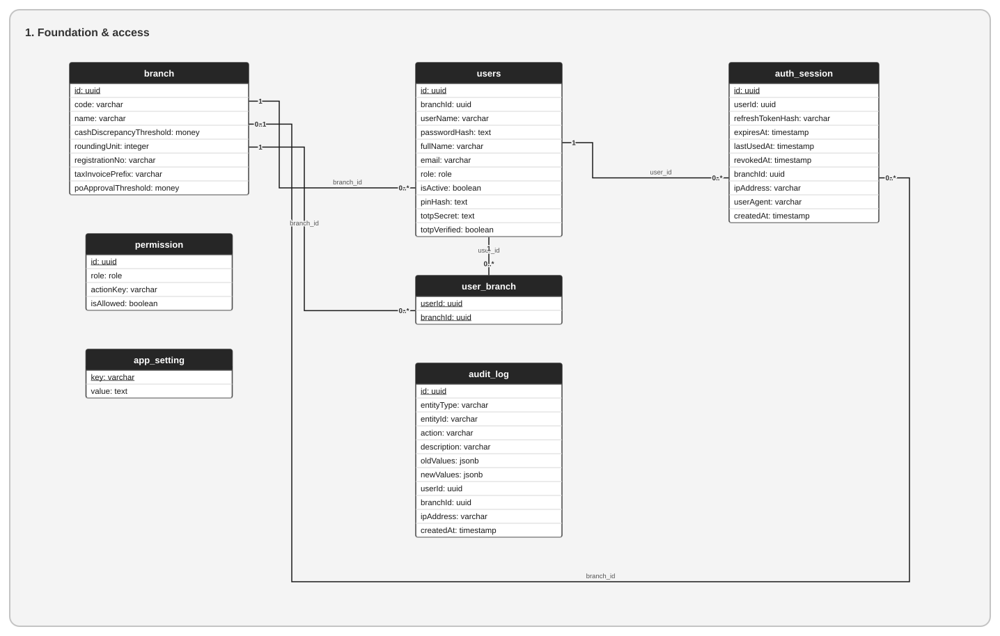

Mermaid classDiagram source

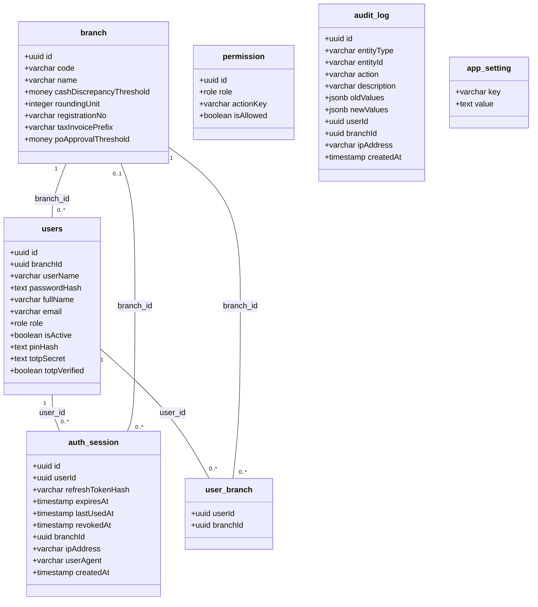
```mermaid
classDiagram
    class branch {
        +uuid id
        +varchar code
        +varchar name
        +money cashDiscrepancyThreshold
        +integer roundingUnit
        +varchar registrationNo
        +varchar taxInvoicePrefix
        +money poApprovalThreshold
    }
    class users {
        +uuid id
        +uuid branchId
        +varchar userName
        +text passwordHash
        +varchar fullName
        +varchar email
        +role role
        +boolean isActive
        +text pinHash
        +text totpSecret
        +boolean totpVerified
    }
    class auth_session {
        +uuid id
        +uuid userId
        +varchar refreshTokenHash
        +timestamp expiresAt
        +timestamp lastUsedAt
        +timestamp revokedAt
        +uuid branchId
        +varchar ipAddress
        +varchar userAgent
        +timestamp createdAt
    }
    class permission {
        +uuid id
        +role role
        +varchar actionKey
        +boolean isAllowed
    }
    class audit_log {
        +uuid id
        +varchar entityType
        +varchar entityId
        +varchar action
        +varchar description
        +jsonb oldValues
        +jsonb newValues
        +uuid userId
        +uuid branchId
        +varchar ipAddress
        +timestamp createdAt
    }
    class user_branch {
        +uuid userId
        +uuid branchId
    }
    class app_setting {
        +varchar key
        +text value
    }

    branch "1" -- "0..*" users : branch_id
    users "1" -- "0..*" auth_session : user_id
    branch "0..1" -- "0..*" auth_session : branch_id
    users "1" -- "0..*" user_branch : user_id
    branch "1" -- "0..*" user_branch : branch_id
```

---

## 2. Catalog & master data

8 classes.

Omitted associations: `category.branch_id → branch`, `unit.branch_id → branch`, `products.branch_id → branch`, `product_uom_conversion.branch_id → branch`, `suppliers.branch_id → branch`, `counter.branch_id → branch` …

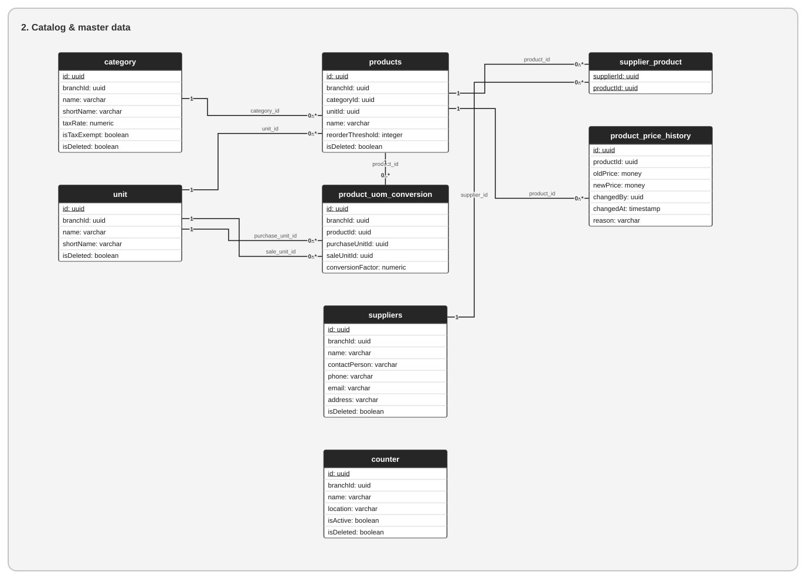

Mermaid classDiagram source

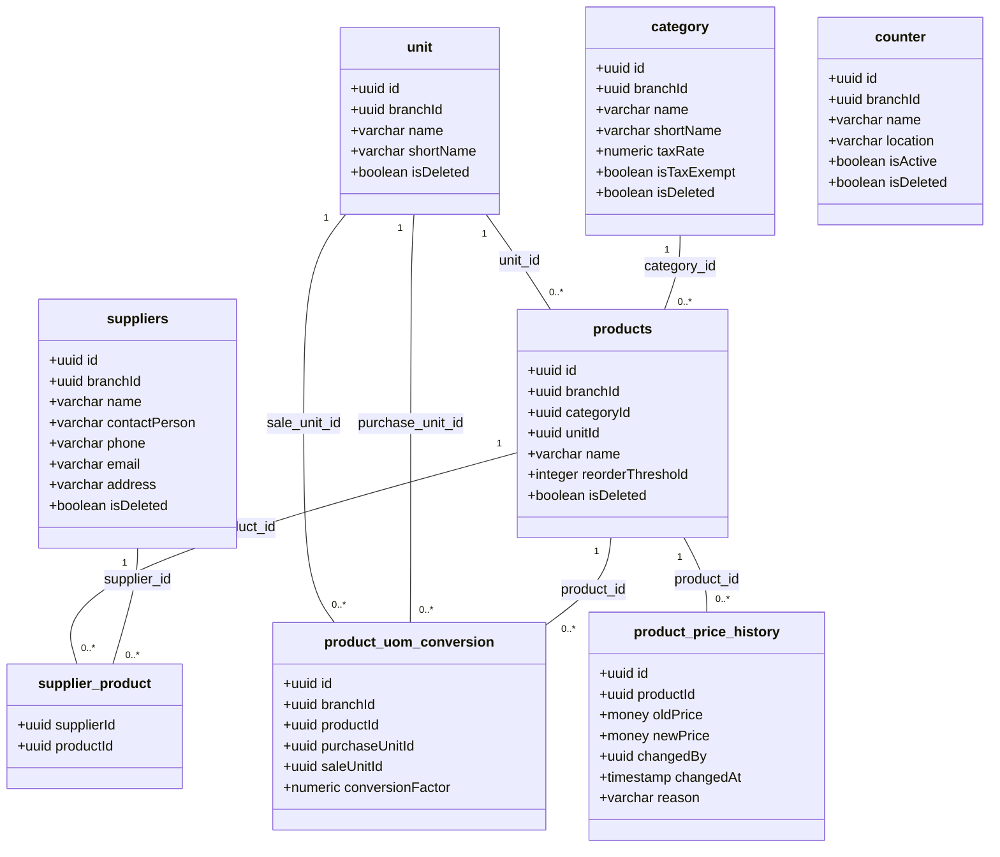
```mermaid
classDiagram
    class category {
        +uuid id
        +uuid branchId
        +varchar name
        +varchar shortName
        +numeric taxRate
        +boolean isTaxExempt
        +boolean isDeleted
    }
    class unit {
        +uuid id
        +uuid branchId
        +varchar name
        +varchar shortName
        +boolean isDeleted
    }
    class products {
        +uuid id
        +uuid branchId
        +uuid categoryId
        +uuid unitId
        +varchar name
        +integer reorderThreshold
        +boolean isDeleted
    }
    class product_uom_conversion {
        +uuid id
        +uuid branchId
        +uuid productId
        +uuid purchaseUnitId
        +uuid saleUnitId
        +numeric conversionFactor
    }
    class suppliers {
        +uuid id
        +uuid branchId
        +varchar name
        +varchar contactPerson
        +varchar phone
        +varchar email
        +varchar address
        +boolean isDeleted
    }
    class supplier_product {
        +uuid supplierId
        +uuid productId
    }
    class counter {
        +uuid id
        +uuid branchId
        +varchar name
        +varchar location
        +boolean isActive
        +boolean isDeleted
    }
    class product_price_history {
        +uuid id
        +uuid productId
        +money oldPrice
        +money newPrice
        +uuid changedBy
        +timestamp changedAt
        +varchar reason
    }

    category "1" -- "0..*" products : category_id
    unit "1" -- "0..*" products : unit_id
    products "1" -- "0..*" product_uom_conversion : product_id
    unit "1" -- "0..*" product_uom_conversion : purchase_unit_id
    unit "1" -- "0..*" product_uom_conversion : sale_unit_id
    suppliers "1" -- "0..*" supplier_product : supplier_id
    products "1" -- "0..*" supplier_product : product_id
    products "1" -- "0..*" product_price_history : product_id
```

---

## 3. Purchasing & stock

13 classes, plus stub classes: products, suppliers.

Omitted associations: `purchase_order.branch_id → branch`, `purchase_order.approved_by → users`, `purchase_order.created_by → users`, `grn.branch_id → branch`, `grn.created_by → users`, `items.branch_id → branch` …

**Stubs** (dashed border): `products`, `suppliers` — cross-group references; full definitions in their owning groups.

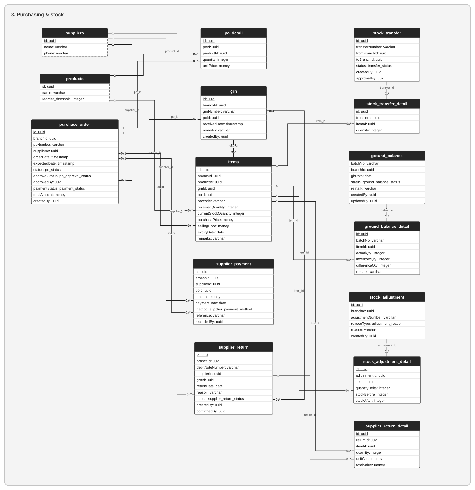

Mermaid classDiagram source

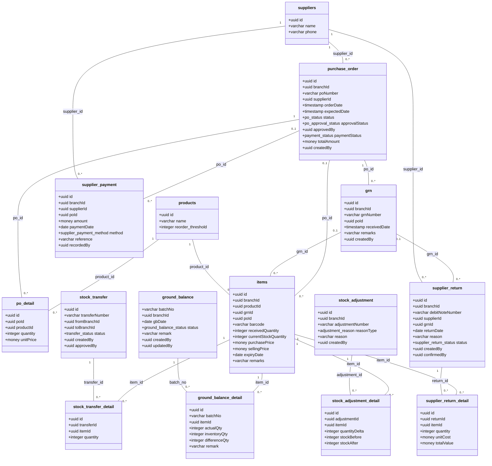
```mermaid
classDiagram
    class purchase_order {
        +uuid id
        +uuid branchId
        +varchar poNumber
        +uuid supplierId
        +timestamp orderDate
        +timestamp expectedDate
        +po_status status
        +po_approval_status approvalStatus
        +uuid approvedBy
        +payment_status paymentStatus
        +money totalAmount
        +uuid createdBy
    }
    class po_detail {
        +uuid id
        +uuid poId
        +uuid productId
        +integer quantity
        +money unitPrice
    }
    class grn {
        +uuid id
        +uuid branchId
        +varchar grnNumber
        +uuid poId
        +timestamp receivedDate
        +varchar remarks
        +uuid createdBy
    }
    class items {
        +uuid id
        +uuid branchId
        +uuid productId
        +uuid grnId
        +uuid poId
        +varchar barcode
        +integer receivedQuantity
        +integer currentStockQuantity
        +money purchasePrice
        +money sellingPrice
        +date expiryDate
        +varchar remarks
    }
    class stock_transfer {
        +uuid id
        +varchar transferNumber
        +uuid fromBranchId
        +uuid toBranchId
        +transfer_status status
        +uuid createdBy
        +uuid approvedBy
    }
    class stock_transfer_detail {
        +uuid id
        +uuid transferId
        +uuid itemId
        +integer quantity
    }
    class ground_balance {
        +varchar batchNo
        +uuid branchId
        +date gbDate
        +ground_balance_status status
        +varchar remark
        +uuid createdBy
        +uuid updatedBy
    }
    class ground_balance_detail {
        +uuid id
        +varchar batchNo
        +uuid itemId
        +integer actualQty
        +integer inventoryQty
        +integer differenceQty
        +varchar remark
    }
    class stock_adjustment {
        +uuid id
        +uuid branchId
        +varchar adjustmentNumber
        +adjustment_reason reasonType
        +varchar reason
        +uuid createdBy
    }
    class stock_adjustment_detail {
        +uuid id
        +uuid adjustmentId
        +uuid itemId
        +integer quantityDelta
        +integer stockBefore
        +integer stockAfter
    }
    class supplier_payment {
        +uuid id
        +uuid branchId
        +uuid supplierId
        +uuid poId
        +money amount
        +date paymentDate
        +supplier_payment_method method
        +varchar reference
        +uuid recordedBy
    }
    class supplier_return {
        +uuid id
        +uuid branchId
        +varchar debitNoteNumber
        +uuid supplierId
        +uuid grnId
        +date returnDate
        +varchar reason
        +supplier_return_status status
        +uuid createdBy
        +uuid confirmedBy
    }
    class supplier_return_detail {
        +uuid id
        +uuid returnId
        +uuid itemId
        +integer quantity
        +money unitCost
        +money totalValue
    }
    class products {
        +uuid id
        +varchar name
        +integer reorder_threshold
    }
    class suppliers {
        +uuid id
        +varchar name
        +varchar phone
    }

    suppliers "1" -- "0..*" purchase_order : supplier_id
    purchase_order "1" -- "0..*" po_detail : po_id
    products "1" -- "0..*" po_detail : product_id
    purchase_order "1" -- "0..*" grn : po_id
    products "1" -- "0..*" items : product_id
    grn "0..1" -- "0..*" items : grn_id
    purchase_order "0..1" -- "0..*" items : po_id
    stock_transfer "1" -- "0..*" stock_transfer_detail : transfer_id
    items "1" -- "0..*" stock_transfer_detail : item_id
    ground_balance "1" -- "0..*" ground_balance_detail : batch_no
    items "1" -- "0..*" ground_balance_detail : item_id
    stock_adjustment "1" -- "0..*" stock_adjustment_detail : adjustment_id
    items "1" -- "0..*" stock_adjustment_detail : item_id
    suppliers "1" -- "0..*" supplier_payment : supplier_id
    purchase_order "0..1" -- "0..*" supplier_payment : po_id
    suppliers "1" -- "0..*" supplier_return : supplier_id
    grn "0..1" -- "0..*" supplier_return : grn_id
    supplier_return "1" -- "0..*" supplier_return_detail : return_id
    items "1" -- "0..*" supplier_return_detail : item_id
```

---

## 4. POS & sales

10 classes, plus stub classes: counter, items, products, users.

Omitted associations: `pos_session.branch_id → branch`, `sale.branch_id → branch`, `sale.created_by → users`, `sale_return.branch_id → branch`, `sale_return.created_by → users`, `sale_return.approved_by → users` …

**Stubs** (dashed border): `counter`, `items`, `products`, `users` — cross-group references; full definitions in their owning groups.

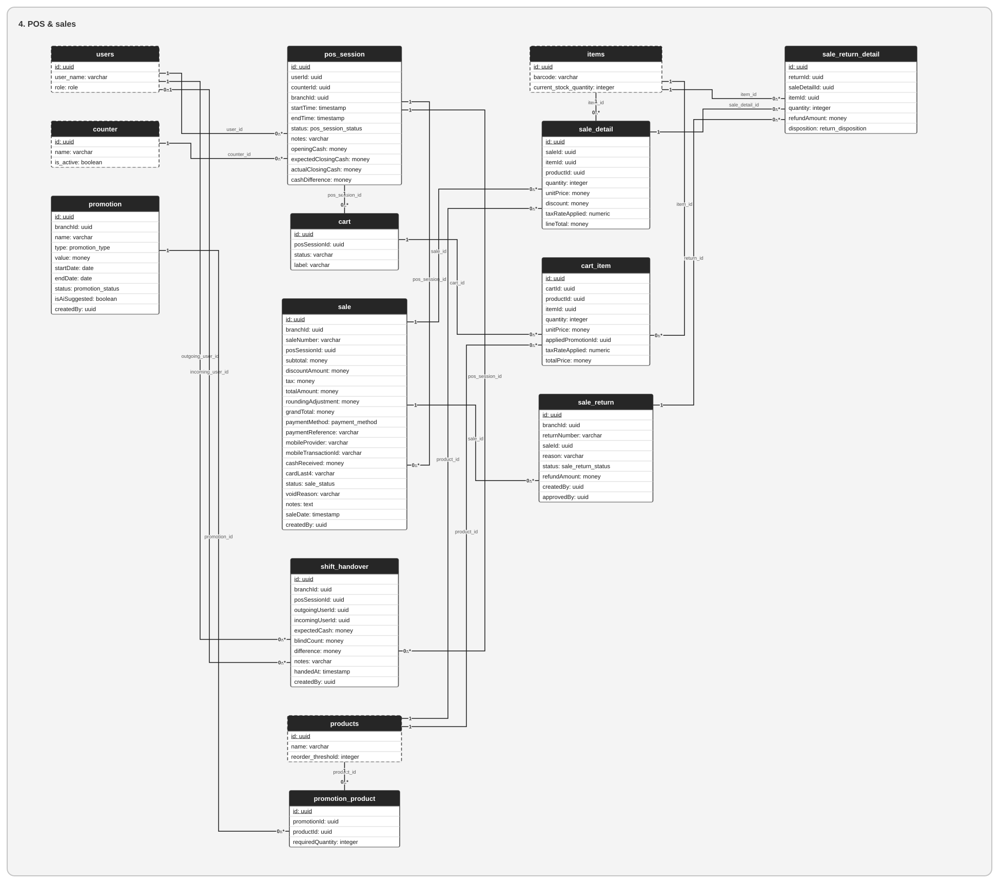

Mermaid classDiagram source

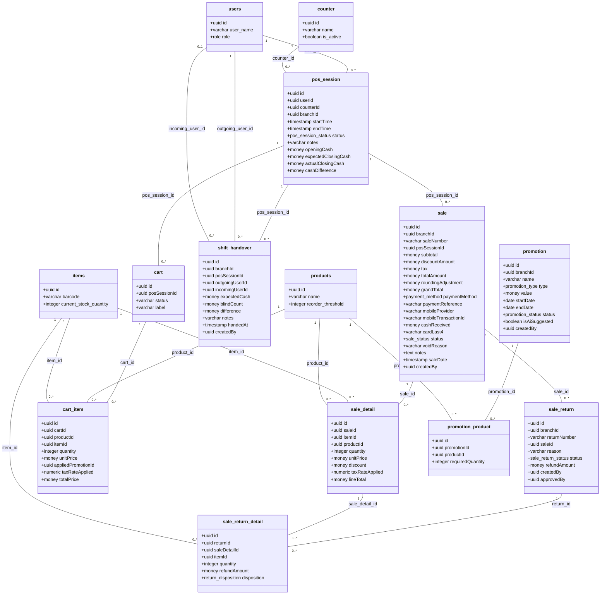
```mermaid
classDiagram
    class pos_session {
        +uuid id
        +uuid userId
        +uuid counterId
        +uuid branchId
        +timestamp startTime
        +timestamp endTime
        +pos_session_status status
        +varchar notes
        +money openingCash
        +money expectedClosingCash
        +money actualClosingCash
        +money cashDifference
    }
    class sale {
        +uuid id
        +uuid branchId
        +varchar saleNumber
        +uuid posSessionId
        +money subtotal
        +money discountAmount
        +money tax
        +money totalAmount
        +money roundingAdjustment
        +money grandTotal
        +payment_method paymentMethod
        +varchar paymentReference
        +varchar mobileProvider
        +varchar mobileTransactionId
        +money cashReceived
        +varchar cardLast4
        +sale_status status
        +varchar voidReason
        +text notes
        +timestamp saleDate
        +uuid createdBy
    }
    class sale_detail {
        +uuid id
        +uuid saleId
        +uuid itemId
        +uuid productId
        +integer quantity
        +money unitPrice
        +money discount
        +numeric taxRateApplied
        +money lineTotal
    }
    class cart {
        +uuid id
        +uuid posSessionId
        +varchar status
        +varchar label
    }
    class cart_item {
        +uuid id
        +uuid cartId
        +uuid productId
        +uuid itemId
        +integer quantity
        +money unitPrice
        +uuid appliedPromotionId
        +numeric taxRateApplied
        +money totalPrice
    }
    class sale_return {
        +uuid id
        +uuid branchId
        +varchar returnNumber
        +uuid saleId
        +varchar reason
        +sale_return_status status
        +money refundAmount
        +uuid createdBy
        +uuid approvedBy
    }
    class sale_return_detail {
        +uuid id
        +uuid returnId
        +uuid saleDetailId
        +uuid itemId
        +integer quantity
        +money refundAmount
        +return_disposition disposition
    }
    class shift_handover {
        +uuid id
        +uuid branchId
        +uuid posSessionId
        +uuid outgoingUserId
        +uuid incomingUserId
        +money expectedCash
        +money blindCount
        +money difference
        +varchar notes
        +timestamp handedAt
        +uuid createdBy
    }
    class promotion {
        +uuid id
        +uuid branchId
        +varchar name
        +promotion_type type
        +money value
        +date startDate
        +date endDate
        +promotion_status status
        +boolean isAiSuggested
        +uuid createdBy
    }
    class promotion_product {
        +uuid id
        +uuid promotionId
        +uuid productId
        +integer requiredQuantity
    }
    class counter {
        +uuid id
        +varchar name
        +boolean is_active
    }
    class items {
        +uuid id
        +varchar barcode
        +integer current_stock_quantity
    }
    class products {
        +uuid id
        +varchar name
        +integer reorder_threshold
    }
    class users {
        +uuid id
        +varchar user_name
        +role role
    }

    users "1" -- "0..*" pos_session : user_id
    counter "1" -- "0..*" pos_session : counter_id
    pos_session "1" -- "0..*" sale : pos_session_id
    sale "1" -- "0..*" sale_detail : sale_id
    items "1" -- "0..*" sale_detail : item_id
    products "1" -- "0..*" sale_detail : product_id
    pos_session "1" -- "0..*" cart : pos_session_id
    cart "1" -- "0..*" cart_item : cart_id
    products "1" -- "0..*" cart_item : product_id
    items "1" -- "0..*" cart_item : item_id
    sale "1" -- "0..*" sale_return : sale_id
    sale_return "1" -- "0..*" sale_return_detail : return_id
    sale_detail "1" -- "0..*" sale_return_detail : sale_detail_id
    items "1" -- "0..*" sale_return_detail : item_id
    pos_session "1" -- "0..*" shift_handover : pos_session_id
    users "1" -- "0..*" shift_handover : outgoing_user_id
    users "0..1" -- "0..*" shift_handover : incoming_user_id
    promotion "1" -- "0..*" promotion_product : promotion_id
    products "1" -- "0..*" promotion_product : product_id
```

---

## 5. Finance & expenses

7 classes, plus stub classes: users.

Omitted associations: `expense_category.branch_id → branch`, `expense.branch_id → branch`, `expense.recorded_by → users`, `expense_budget.branch_id → branch`, `journal_entry.branch_id → branch`, `journal_entry.created_by → users` …

**Stubs** (dashed border): `users` — cross-group references; full definitions in their owning groups.

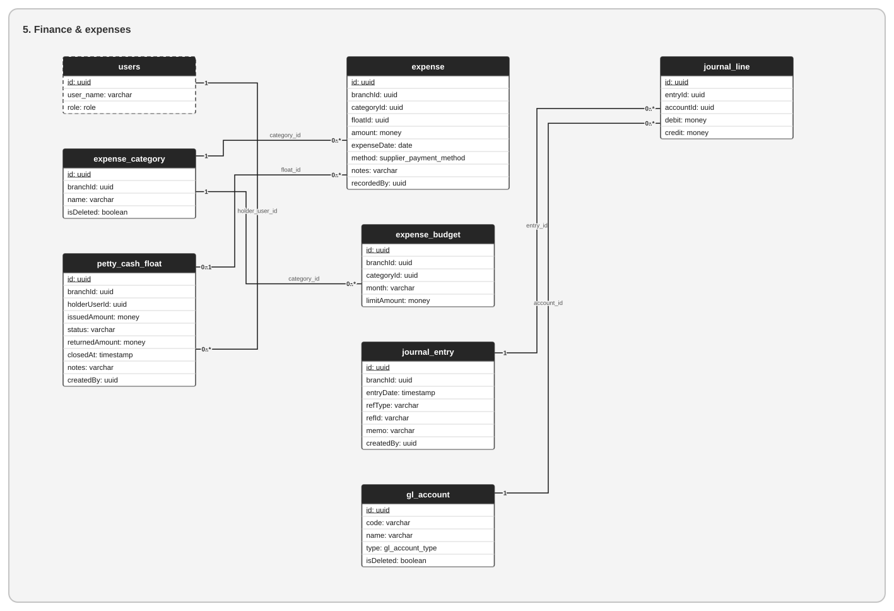

Mermaid classDiagram source

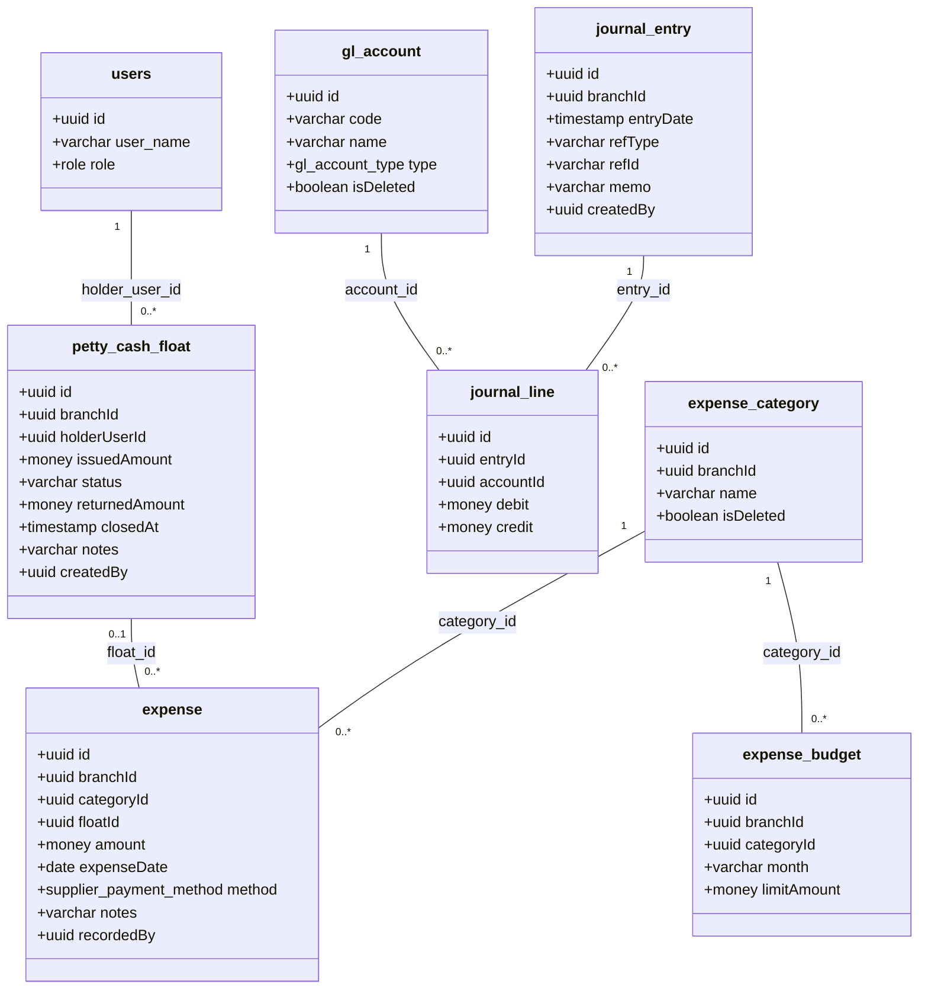
```mermaid
classDiagram
    class expense_category {
        +uuid id
        +uuid branchId
        +varchar name
        +boolean isDeleted
    }
    class expense {
        +uuid id
        +uuid branchId
        +uuid categoryId
        +uuid floatId
        +money amount
        +date expenseDate
        +supplier_payment_method method
        +varchar notes
        +uuid recordedBy
    }
    class expense_budget {
        +uuid id
        +uuid branchId
        +uuid categoryId
        +varchar month
        +money limitAmount
    }
    class gl_account {
        +uuid id
        +varchar code
        +varchar name
        +gl_account_type type
        +boolean isDeleted
    }
    class journal_entry {
        +uuid id
        +uuid branchId
        +timestamp entryDate
        +varchar refType
        +varchar refId
        +varchar memo
        +uuid createdBy
    }
    class journal_line {
        +uuid id
        +uuid entryId
        +uuid accountId
        +money debit
        +money credit
    }
    class petty_cash_float {
        +uuid id
        +uuid branchId
        +uuid holderUserId
        +money issuedAmount
        +varchar status
        +money returnedAmount
        +timestamp closedAt
        +varchar notes
        +uuid createdBy
    }
    class users {
        +uuid id
        +varchar user_name
        +role role
    }

    expense_category "1" -- "0..*" expense : category_id
    petty_cash_float "0..1" -- "0..*" expense : float_id
    expense_category "1" -- "0..*" expense_budget : category_id
    journal_entry "1" -- "0..*" journal_line : entry_id
    gl_account "1" -- "0..*" journal_line : account_id
    users "1" -- "0..*" petty_cash_float : holder_user_id
```

---

## 6. Staff & notifications

6 classes, plus stub classes: counter, users.

Omitted associations: `shift_roster.branch_id → branch`, `shift_roster.created_by → users`, `roster_schedule.branch_id → branch`, `roster_schedule.created_by → users`, `staff_attendance.branch_id → branch`, `notification.branch_id → branch`

**Stubs** (dashed border): `counter`, `users` — cross-group references; full definitions in their owning groups.

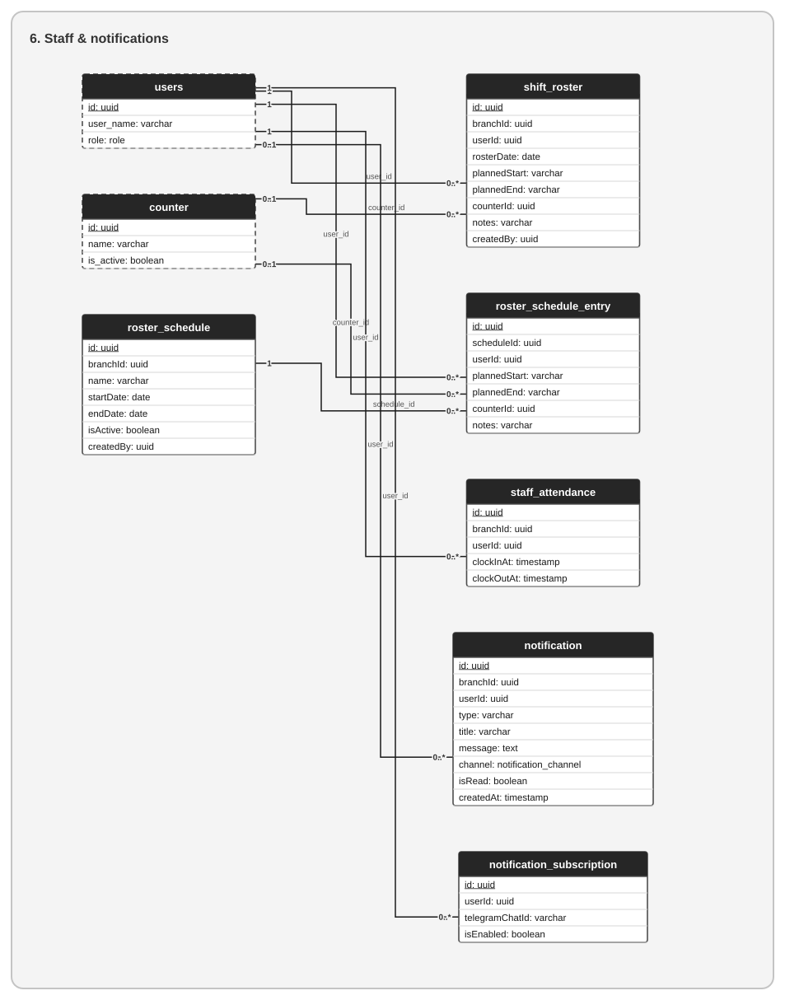

Mermaid classDiagram source

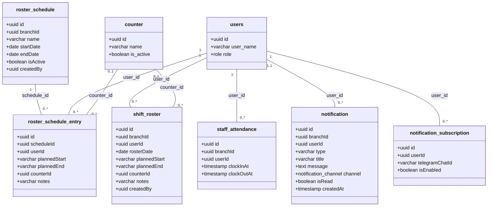
```mermaid
classDiagram
    class shift_roster {
        +uuid id
        +uuid branchId
        +uuid userId
        +date rosterDate
        +varchar plannedStart
        +varchar plannedEnd
        +uuid counterId
        +varchar notes
        +uuid createdBy
    }
    class roster_schedule {
        +uuid id
        +uuid branchId
        +varchar name
        +date startDate
        +date endDate
        +boolean isActive
        +uuid createdBy
    }
    class roster_schedule_entry {
        +uuid id
        +uuid scheduleId
        +uuid userId
        +varchar plannedStart
        +varchar plannedEnd
        +uuid counterId
        +varchar notes
    }
    class staff_attendance {
        +uuid id
        +uuid branchId
        +uuid userId
        +timestamp clockInAt
        +timestamp clockOutAt
    }
    class notification {
        +uuid id
        +uuid branchId
        +uuid userId
        +varchar type
        +varchar title
        +text message
        +notification_channel channel
        +boolean isRead
        +timestamp createdAt
    }
    class notification_subscription {
        +uuid id
        +uuid userId
        +varchar telegramChatId
        +boolean isEnabled
    }
    class counter {
        +uuid id
        +varchar name
        +boolean is_active
    }
    class users {
        +uuid id
        +varchar user_name
        +role role
    }

    users "1" -- "0..*" shift_roster : user_id
    counter "0..1" -- "0..*" shift_roster : counter_id
    roster_schedule "1" -- "0..*" roster_schedule_entry : schedule_id
    users "1" -- "0..*" roster_schedule_entry : user_id
    counter "0..1" -- "0..*" roster_schedule_entry : counter_id
    users "1" -- "0..*" staff_attendance : user_id
    users "0..1" -- "0..*" notification : user_id
    users "1" -- "0..*" notification_subscription : user_id
```

---

## 7. AI

4 classes, plus stub classes: users.

Omitted associations: `ai_api_key.created_by → users`, `ai_api_key.updated_by → users`, `ai_model.created_by → users`, `ai_model.updated_by → users`, `ai_chat_conversation.branch_id → branch`

**Stubs** (dashed border): `users` — cross-group references; full definitions in their owning groups.

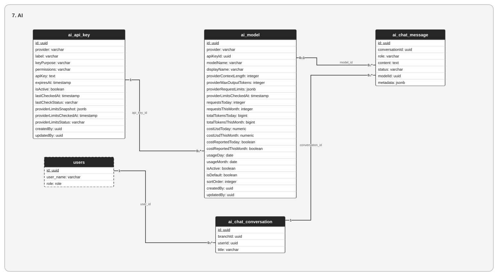

Mermaid classDiagram source

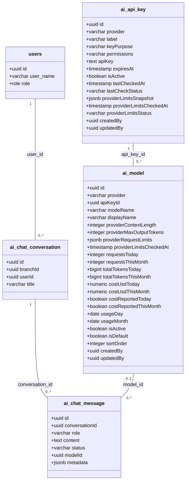
```mermaid
classDiagram
    class ai_api_key {
        +uuid id
        +varchar provider
        +varchar label
        +varchar keyPurpose
        +varchar permissions
        +text apiKey
        +timestamp expiresAt
        +boolean isActive
        +timestamp lastCheckedAt
        +varchar lastCheckStatus
        +jsonb providerLimitsSnapshot
        +timestamp providerLimitsCheckedAt
        +varchar providerLimitsStatus
        +uuid createdBy
        +uuid updatedBy
    }
    class ai_model {
        +uuid id
        +varchar provider
        +uuid apiKeyId
        +varchar modelName
        +varchar displayName
        +integer providerContextLength
        +integer providerMaxOutputTokens
        +jsonb providerRequestLimits
        +timestamp providerLimitsCheckedAt
        +integer requestsToday
        +integer requestsThisMonth
        +bigint totalTokensToday
        +bigint totalTokensThisMonth
        +numeric costUsdToday
        +numeric costUsdThisMonth
        +boolean costReportedToday
        +boolean costReportedThisMonth
        +date usageDay
        +date usageMonth
        +boolean isActive
        +boolean isDefault
        +integer sortOrder
        +uuid createdBy
        +uuid updatedBy
    }
    class ai_chat_conversation {
        +uuid id
        +uuid branchId
        +uuid userId
        +varchar title
    }
    class ai_chat_message {
        +uuid id
        +uuid conversationId
        +varchar role
        +text content
        +varchar status
        +uuid modelId
        +jsonb metadata
    }
    class users {
        +uuid id
        +varchar user_name
        +role role
    }

    ai_api_key "1" -- "0..*" ai_model : api_key_id
    users "1" -- "0..*" ai_chat_conversation : user_id
    ai_chat_conversation "1" -- "0..*" ai_chat_message : conversation_id
    ai_model "0..1" -- "0..*" ai_chat_message : model_id
```

---

## Enum types used as attribute types

| Enum                      | Values                                    |
| ------------------------- | ----------------------------------------- |
| `role`                    | admin, inventory, cashier                 |
| `po_status`               | pending, partially_received, received     |
| `po_approval_status`      | pending, approved, rejected               |
| `payment_status`          | unpaid, partial, paid                     |
| `sale_status`             | pending, completed, voided                |
| `payment_method`          | cash, card, mobile, credit                |
| `pos_session_status`      | active, closed                            |
| `transfer_status`         | pending, approved, in_transit, received   |
| `supplier_return_status`  | draft, confirmed                          |
| `sale_return_status`      | pending, approved                         |
| `return_disposition`      | restock, damage                           |
| `promotion_type`          | percentage, fixed, bundle, seasonal       |
| `promotion_status`        | draft, active, expired, deactivated       |
| `supplier_payment_method` | cash, bank_transfer, mobile_payment       |
| `notification_channel`    | in_app, telegram                          |
| `ground_balance_status`   | pending, completed, cancelled             |
| `adjustment_reason`       | damage, loss, found, correction           |
| `gl_account_type`         | asset, liability, equity, income, expense |

**Conventions:** UUID PKs (exceptions: `app_setting.key`, `ground_balance.batch_no`; junctions `user_branch` / `supplier_product` use composite logical PKs of their FK columns); `numeric` money; `timestamp` UTC; soft-delete `is_deleted` on master data; every column listed exactly as declared in `schema.ts`.
