# SmartRetailAI Schema Diagrams

Entity-relationship diagrams generated from the Drizzle declarations in [`web-app/db/schema.ts`](../web-app/db/schema.ts) — 55 tables, 425 columns, 18 enums, 125 foreign keys. Each of the 7 diagrams is a **complete ERD for its domain**: every column, key markers, and an edge for every structural foreign key with correct cardinality. Each group is rendered as:

- a styled **SVG** (`schema_erd_N.svg`, embedded below) — dark header, `PK` / `UQ` / `FK1…` key column, crow's-foot connectors, drawn on a light rounded panel;
- the **mermaid `erDiagram` source** (collapsible below the image);
- the same page in the editable [`schema.drawio`](./schema.drawio) (edges are bound to their entities).

**Notation (crow's foot)**

- parent end ❘ (bar): child row references exactly one parent row (FK is `NOT NULL`); with a small circle (`o❘`): FK is nullable (zero or one)
- child end ⟨❘ with three prongs: a parent row has zero or more children (small circle = zero allowed)
- key column: `PK` primary key (underlined name), `UQ` unique, `FK1`, `FK2`… numbered in column order; composite junction PKs show `PK` on both columns
- mermaid equivalents: `||` required parent, `|o` nullable parent, `o{` children; attribute keys `PK` / `UK` / `FK`

**Diagram conventions**

- Edges into `branch` (`branch_id` / `from_branch_id` / `to_branch_id`) are omitted outside group 1 (Foundation) — `branch` is referenced by nearly every operational table (listed under each group as omitted).
- Audit user references (`created_by`, `updated_by`, `approved_by`, `changed_by`, `recorded_by`, `confirmed_by` → `users`) are omitted and listed per group.
- **Stubs** (e.g. `users`, `products`, `items`, `suppliers`, `counter` outside their home group) show only PK/identity columns with a dashed border; the full definition lives in the owning group.

**Groups**

| #   | Group                 | Tables                                      | Edges |
| --- | --------------------- | ------------------------------------------- | ----- |
| 1   | Foundation & access   | 7                                           | 5     |
| 2   | Catalog & master data | 8                                           | 8     |
| 3   | Purchasing & stock    | 13 (+stub: products, suppliers)             | 19    |
| 4   | POS & sales           | 10 (+stub: counter, items, products, users) | 19    |
| 5   | Finance & expenses    | 7 (+stub: users)                            | 6     |
| 6   | Staff & notifications | 6 (+stub: counter, users)                   | 8     |
| 7   | AI                    | 4 (+stub: users)                            | 4     |

---

## 1. Foundation & access

7 tables.

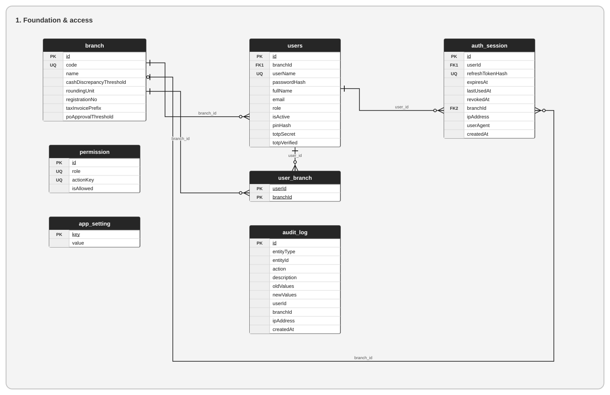

Mermaid source

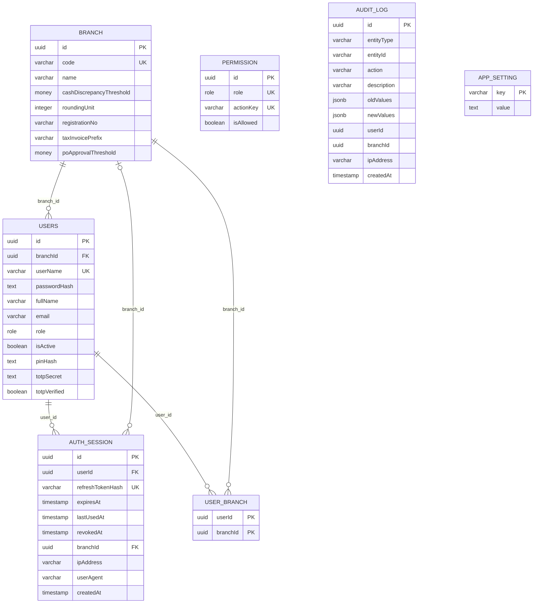
```mermaid
erDiagram
    BRANCH {
        uuid id PK
        varchar code UK
        varchar name
        money cashDiscrepancyThreshold
        integer roundingUnit
        varchar registrationNo
        varchar taxInvoicePrefix
        money poApprovalThreshold
    }
    USERS {
        uuid id PK
        uuid branchId FK
        varchar userName UK
        text passwordHash
        varchar fullName
        varchar email
        role role
        boolean isActive
        text pinHash
        text totpSecret
        boolean totpVerified
    }
    AUTH_SESSION {
        uuid id PK
        uuid userId FK
        varchar refreshTokenHash UK
        timestamp expiresAt
        timestamp lastUsedAt
        timestamp revokedAt
        uuid branchId FK
        varchar ipAddress
        varchar userAgent
        timestamp createdAt
    }
    PERMISSION {
        uuid id PK
        role role UK
        varchar actionKey UK
        boolean isAllowed
    }
    AUDIT_LOG {
        uuid id PK
        varchar entityType
        varchar entityId
        varchar action
        varchar description
        jsonb oldValues
        jsonb newValues
        uuid userId
        uuid branchId
        varchar ipAddress
        timestamp createdAt
    }
    USER_BRANCH {
        uuid userId PK
        uuid branchId PK
    }
    APP_SETTING {
        varchar key PK
        text value
    }

    BRANCH ||--o{ USERS : branch_id
    USERS ||--o{ AUTH_SESSION : user_id
    BRANCH |o--o{ AUTH_SESSION : branch_id
    USERS ||--o{ USER_BRANCH : user_id
    BRANCH ||--o{ USER_BRANCH : branch_id
```

---

## 2. Catalog & master data

8 tables.

Omitted edges: `category.branch_id → branch`, `unit.branch_id → branch`, `products.branch_id → branch`, `product_uom_conversion.branch_id → branch`, `suppliers.branch_id → branch`, `counter.branch_id → branch` …

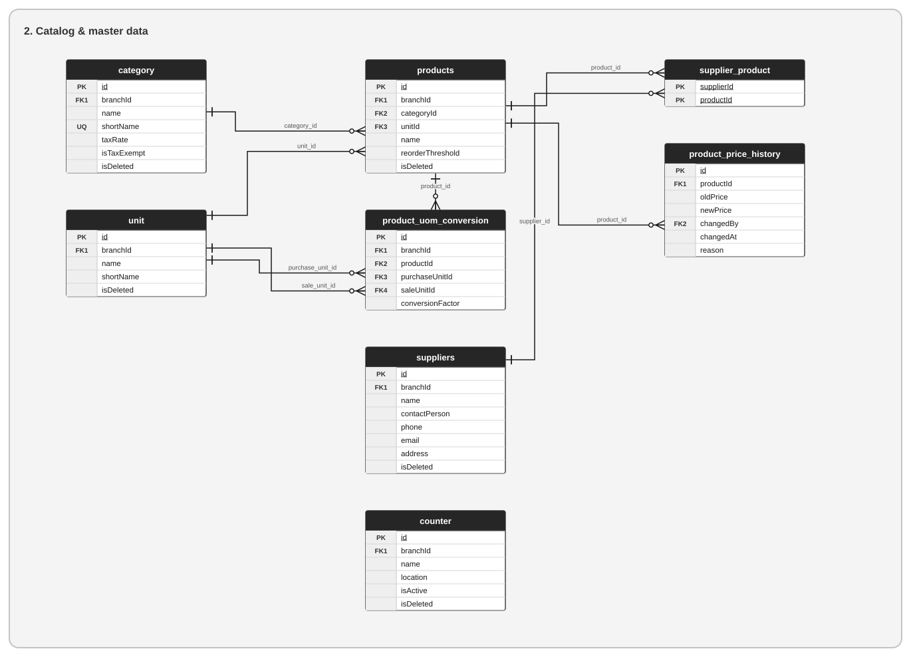

Mermaid source

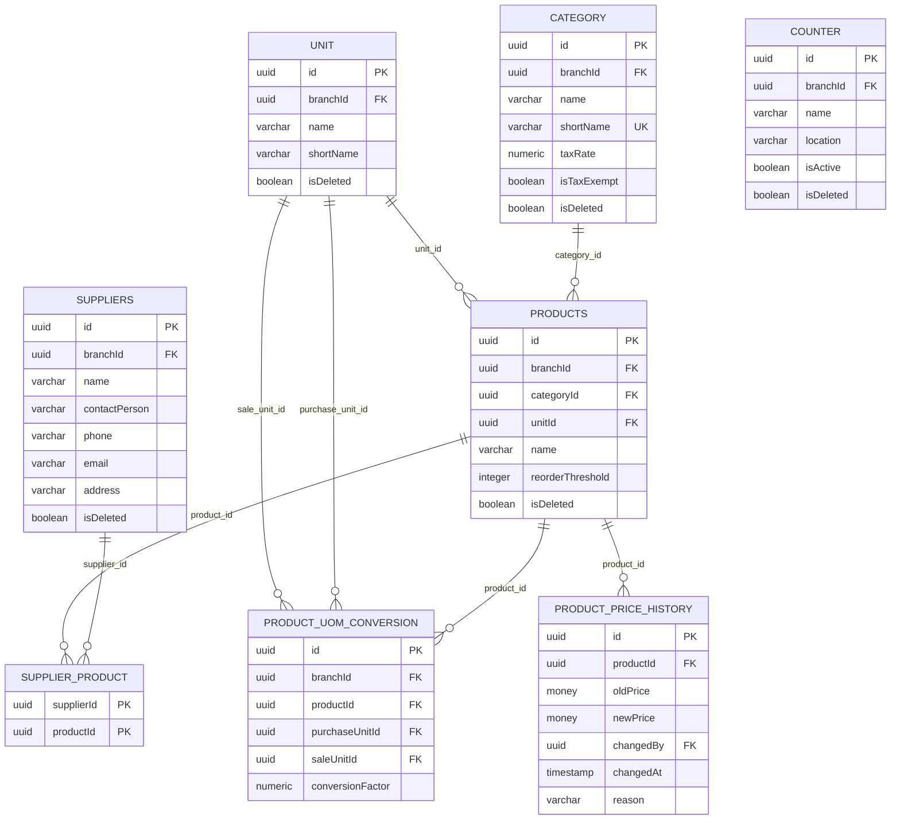
```mermaid
erDiagram
    CATEGORY {
        uuid id PK
        uuid branchId FK
        varchar name
        varchar shortName UK
        numeric taxRate
        boolean isTaxExempt
        boolean isDeleted
    }
    UNIT {
        uuid id PK
        uuid branchId FK
        varchar name
        varchar shortName
        boolean isDeleted
    }
    PRODUCTS {
        uuid id PK
        uuid branchId FK
        uuid categoryId FK
        uuid unitId FK
        varchar name
        integer reorderThreshold
        boolean isDeleted
    }
    PRODUCT_UOM_CONVERSION {
        uuid id PK
        uuid branchId FK
        uuid productId FK
        uuid purchaseUnitId FK
        uuid saleUnitId FK
        numeric conversionFactor
    }
    SUPPLIERS {
        uuid id PK
        uuid branchId FK
        varchar name
        varchar contactPerson
        varchar phone
        varchar email
        varchar address
        boolean isDeleted
    }
    SUPPLIER_PRODUCT {
        uuid supplierId PK
        uuid productId PK
    }
    COUNTER {
        uuid id PK
        uuid branchId FK
        varchar name
        varchar location
        boolean isActive
        boolean isDeleted
    }
    PRODUCT_PRICE_HISTORY {
        uuid id PK
        uuid productId FK
        money oldPrice
        money newPrice
        uuid changedBy FK
        timestamp changedAt
        varchar reason
    }

    CATEGORY ||--o{ PRODUCTS : category_id
    UNIT ||--o{ PRODUCTS : unit_id
    PRODUCTS ||--o{ PRODUCT_UOM_CONVERSION : product_id
    UNIT ||--o{ PRODUCT_UOM_CONVERSION : purchase_unit_id
    UNIT ||--o{ PRODUCT_UOM_CONVERSION : sale_unit_id
    SUPPLIERS ||--o{ SUPPLIER_PRODUCT : supplier_id
    PRODUCTS ||--o{ SUPPLIER_PRODUCT : product_id
    PRODUCTS ||--o{ PRODUCT_PRICE_HISTORY : product_id
```

---

## 3. Purchasing & stock

13 tables, plus stubs: products, suppliers.

Omitted edges: `purchase_order.branch_id → branch`, `purchase_order.approved_by → users`, `purchase_order.created_by → users`, `grn.branch_id → branch`, `grn.created_by → users`, `items.branch_id → branch` …

**Stubs** (dashed border): `products`, `suppliers` — cross-group references; full definitions in their owning groups.

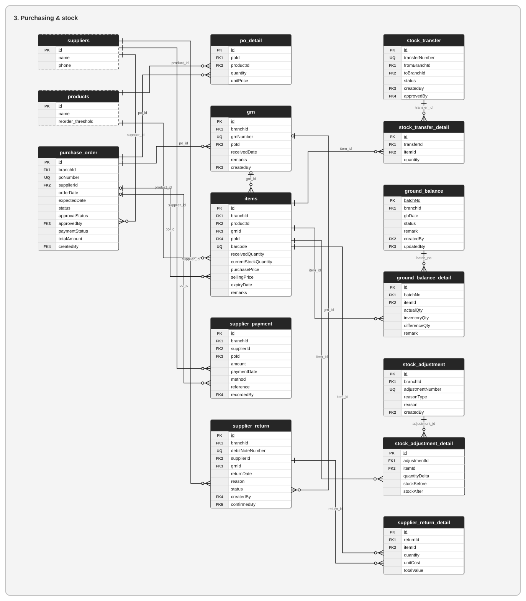

Mermaid source

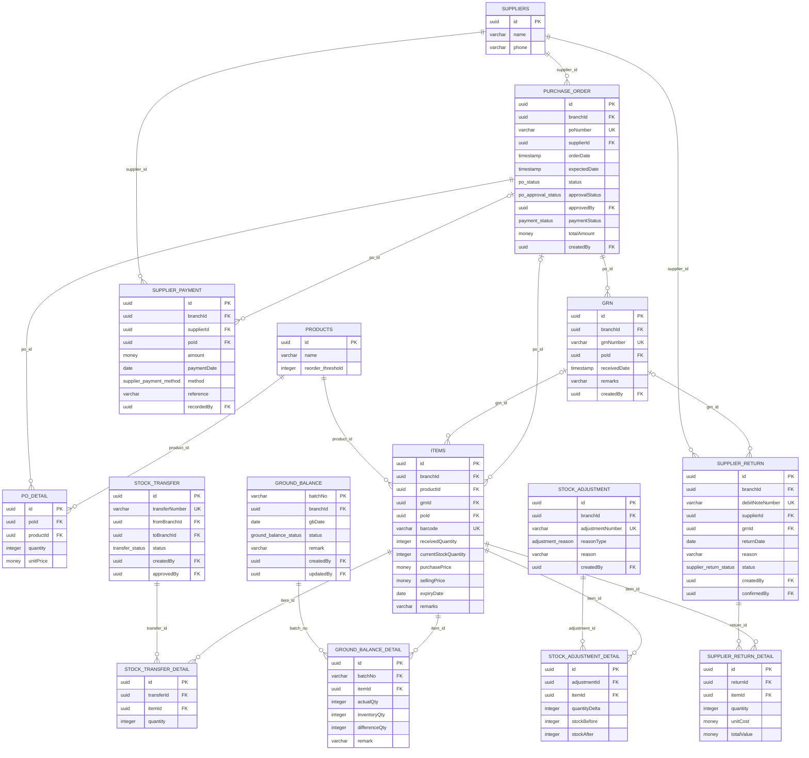
```mermaid
erDiagram
    PURCHASE_ORDER {
        uuid id PK
        uuid branchId FK
        varchar poNumber UK
        uuid supplierId FK
        timestamp orderDate
        timestamp expectedDate
        po_status status
        po_approval_status approvalStatus
        uuid approvedBy FK
        payment_status paymentStatus
        money totalAmount
        uuid createdBy FK
    }
    PO_DETAIL {
        uuid id PK
        uuid poId FK
        uuid productId FK
        integer quantity
        money unitPrice
    }
    GRN {
        uuid id PK
        uuid branchId FK
        varchar grnNumber UK
        uuid poId FK
        timestamp receivedDate
        varchar remarks
        uuid createdBy FK
    }
    ITEMS {
        uuid id PK
        uuid branchId FK
        uuid productId FK
        uuid grnId FK
        uuid poId FK
        varchar barcode UK
        integer receivedQuantity
        integer currentStockQuantity
        money purchasePrice
        money sellingPrice
        date expiryDate
        varchar remarks
    }
    STOCK_TRANSFER {
        uuid id PK
        varchar transferNumber UK
        uuid fromBranchId FK
        uuid toBranchId FK
        transfer_status status
        uuid createdBy FK
        uuid approvedBy FK
    }
    STOCK_TRANSFER_DETAIL {
        uuid id PK
        uuid transferId FK
        uuid itemId FK
        integer quantity
    }
    GROUND_BALANCE {
        varchar batchNo PK
        uuid branchId FK
        date gbDate
        ground_balance_status status
        varchar remark
        uuid createdBy FK
        uuid updatedBy FK
    }
    GROUND_BALANCE_DETAIL {
        uuid id PK
        varchar batchNo FK
        uuid itemId FK
        integer actualQty
        integer inventoryQty
        integer differenceQty
        varchar remark
    }
    STOCK_ADJUSTMENT {
        uuid id PK
        uuid branchId FK
        varchar adjustmentNumber UK
        adjustment_reason reasonType
        varchar reason
        uuid createdBy FK
    }
    STOCK_ADJUSTMENT_DETAIL {
        uuid id PK
        uuid adjustmentId FK
        uuid itemId FK
        integer quantityDelta
        integer stockBefore
        integer stockAfter
    }
    SUPPLIER_PAYMENT {
        uuid id PK
        uuid branchId FK
        uuid supplierId FK
        uuid poId FK
        money amount
        date paymentDate
        supplier_payment_method method
        varchar reference
        uuid recordedBy FK
    }
    SUPPLIER_RETURN {
        uuid id PK
        uuid branchId FK
        varchar debitNoteNumber UK
        uuid supplierId FK
        uuid grnId FK
        date returnDate
        varchar reason
        supplier_return_status status
        uuid createdBy FK
        uuid confirmedBy FK
    }
    SUPPLIER_RETURN_DETAIL {
        uuid id PK
        uuid returnId FK
        uuid itemId FK
        integer quantity
        money unitCost
        money totalValue
    }
    PRODUCTS {
        uuid id PK
        varchar name
        integer reorder_threshold
    }
    SUPPLIERS {
        uuid id PK
        varchar name
        varchar phone
    }

    SUPPLIERS ||--o{ PURCHASE_ORDER : supplier_id
    PURCHASE_ORDER ||--o{ PO_DETAIL : po_id
    PRODUCTS ||--o{ PO_DETAIL : product_id
    PURCHASE_ORDER ||--o{ GRN : po_id
    PRODUCTS ||--o{ ITEMS : product_id
    GRN |o--o{ ITEMS : grn_id
    PURCHASE_ORDER |o--o{ ITEMS : po_id
    STOCK_TRANSFER ||--o{ STOCK_TRANSFER_DETAIL : transfer_id
    ITEMS ||--o{ STOCK_TRANSFER_DETAIL : item_id
    GROUND_BALANCE ||--o{ GROUND_BALANCE_DETAIL : batch_no
    ITEMS ||--o{ GROUND_BALANCE_DETAIL : item_id
    STOCK_ADJUSTMENT ||--o{ STOCK_ADJUSTMENT_DETAIL : adjustment_id
    ITEMS ||--o{ STOCK_ADJUSTMENT_DETAIL : item_id
    SUPPLIERS ||--o{ SUPPLIER_PAYMENT : supplier_id
    PURCHASE_ORDER |o--o{ SUPPLIER_PAYMENT : po_id
    SUPPLIERS ||--o{ SUPPLIER_RETURN : supplier_id
    GRN |o--o{ SUPPLIER_RETURN : grn_id
    SUPPLIER_RETURN ||--o{ SUPPLIER_RETURN_DETAIL : return_id
    ITEMS ||--o{ SUPPLIER_RETURN_DETAIL : item_id
```

---

## 4. POS & sales

10 tables, plus stubs: counter, items, products, users.

Omitted edges: `pos_session.branch_id → branch`, `sale.branch_id → branch`, `sale.created_by → users`, `sale_return.branch_id → branch`, `sale_return.created_by → users`, `sale_return.approved_by → users` …

**Stubs** (dashed border): `counter`, `items`, `products`, `users` — cross-group references; full definitions in their owning groups.

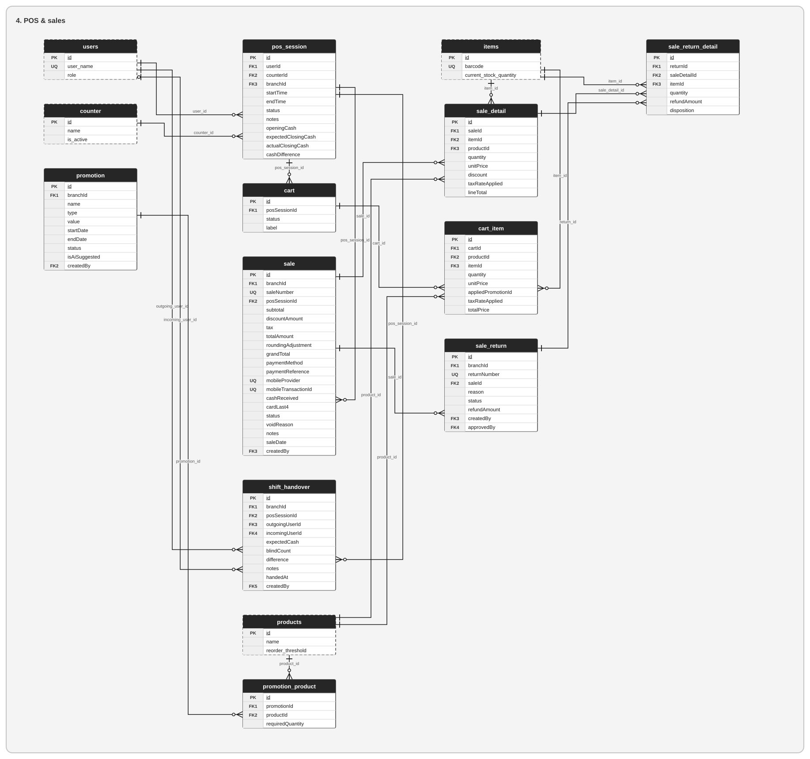

Mermaid source

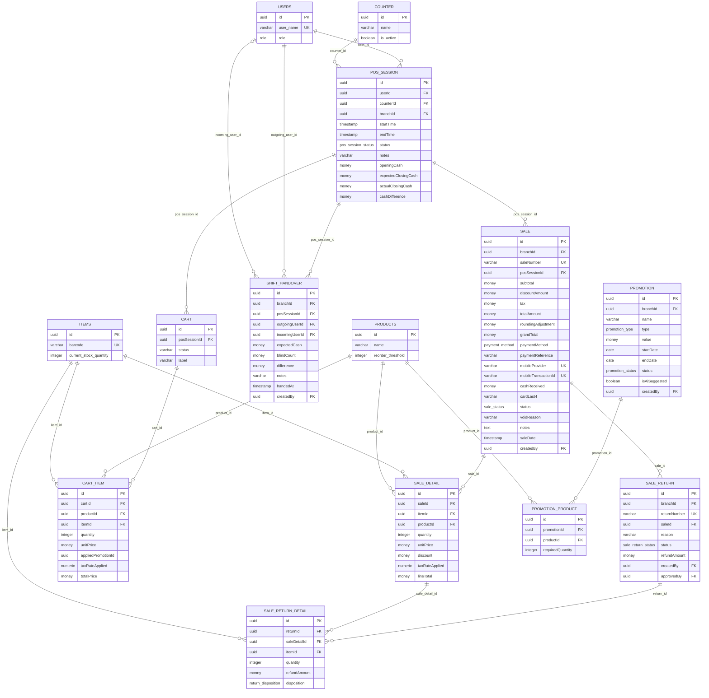
```mermaid
erDiagram
    POS_SESSION {
        uuid id PK
        uuid userId FK
        uuid counterId FK
        uuid branchId FK
        timestamp startTime
        timestamp endTime
        pos_session_status status
        varchar notes
        money openingCash
        money expectedClosingCash
        money actualClosingCash
        money cashDifference
    }
    SALE {
        uuid id PK
        uuid branchId FK
        varchar saleNumber UK
        uuid posSessionId FK
        money subtotal
        money discountAmount
        money tax
        money totalAmount
        money roundingAdjustment
        money grandTotal
        payment_method paymentMethod
        varchar paymentReference
        varchar mobileProvider UK
        varchar mobileTransactionId UK
        money cashReceived
        varchar cardLast4
        sale_status status
        varchar voidReason
        text notes
        timestamp saleDate
        uuid createdBy FK
    }
    SALE_DETAIL {
        uuid id PK
        uuid saleId FK
        uuid itemId FK
        uuid productId FK
        integer quantity
        money unitPrice
        money discount
        numeric taxRateApplied
        money lineTotal
    }
    CART {
        uuid id PK
        uuid posSessionId FK
        varchar status
        varchar label
    }
    CART_ITEM {
        uuid id PK
        uuid cartId FK
        uuid productId FK
        uuid itemId FK
        integer quantity
        money unitPrice
        uuid appliedPromotionId
        numeric taxRateApplied
        money totalPrice
    }
    SALE_RETURN {
        uuid id PK
        uuid branchId FK
        varchar returnNumber UK
        uuid saleId FK
        varchar reason
        sale_return_status status
        money refundAmount
        uuid createdBy FK
        uuid approvedBy FK
    }
    SALE_RETURN_DETAIL {
        uuid id PK
        uuid returnId FK
        uuid saleDetailId FK
        uuid itemId FK
        integer quantity
        money refundAmount
        return_disposition disposition
    }
    SHIFT_HANDOVER {
        uuid id PK
        uuid branchId FK
        uuid posSessionId FK
        uuid outgoingUserId FK
        uuid incomingUserId FK
        money expectedCash
        money blindCount
        money difference
        varchar notes
        timestamp handedAt
        uuid createdBy FK
    }
    PROMOTION {
        uuid id PK
        uuid branchId FK
        varchar name
        promotion_type type
        money value
        date startDate
        date endDate
        promotion_status status
        boolean isAiSuggested
        uuid createdBy FK
    }
    PROMOTION_PRODUCT {
        uuid id PK
        uuid promotionId FK
        uuid productId FK
        integer requiredQuantity
    }
    COUNTER {
        uuid id PK
        varchar name
        boolean is_active
    }
    ITEMS {
        uuid id PK
        varchar barcode UK
        integer current_stock_quantity
    }
    PRODUCTS {
        uuid id PK
        varchar name
        integer reorder_threshold
    }
    USERS {
        uuid id PK
        varchar user_name UK
        role role
    }

    USERS ||--o{ POS_SESSION : user_id
    COUNTER ||--o{ POS_SESSION : counter_id
    POS_SESSION ||--o{ SALE : pos_session_id
    SALE ||--o{ SALE_DETAIL : sale_id
    ITEMS ||--o{ SALE_DETAIL : item_id
    PRODUCTS ||--o{ SALE_DETAIL : product_id
    POS_SESSION ||--o{ CART : pos_session_id
    CART ||--o{ CART_ITEM : cart_id
    PRODUCTS ||--o{ CART_ITEM : product_id
    ITEMS ||--o{ CART_ITEM : item_id
    SALE ||--o{ SALE_RETURN : sale_id
    SALE_RETURN ||--o{ SALE_RETURN_DETAIL : return_id
    SALE_DETAIL ||--o{ SALE_RETURN_DETAIL : sale_detail_id
    ITEMS ||--o{ SALE_RETURN_DETAIL : item_id
    POS_SESSION ||--o{ SHIFT_HANDOVER : pos_session_id
    USERS ||--o{ SHIFT_HANDOVER : outgoing_user_id
    USERS |o--o{ SHIFT_HANDOVER : incoming_user_id
    PROMOTION ||--o{ PROMOTION_PRODUCT : promotion_id
    PRODUCTS ||--o{ PROMOTION_PRODUCT : product_id
```

---

## 5. Finance & expenses

7 tables, plus stubs: users.

Omitted edges: `expense_category.branch_id → branch`, `expense.branch_id → branch`, `expense.recorded_by → users`, `expense_budget.branch_id → branch`, `journal_entry.branch_id → branch`, `journal_entry.created_by → users` …

**Stubs** (dashed border): `users` — cross-group references; full definitions in their owning groups.

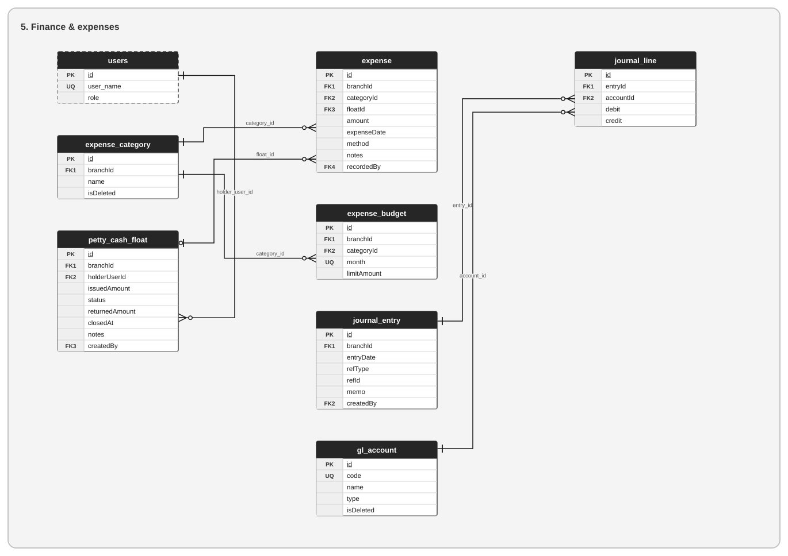

Mermaid source

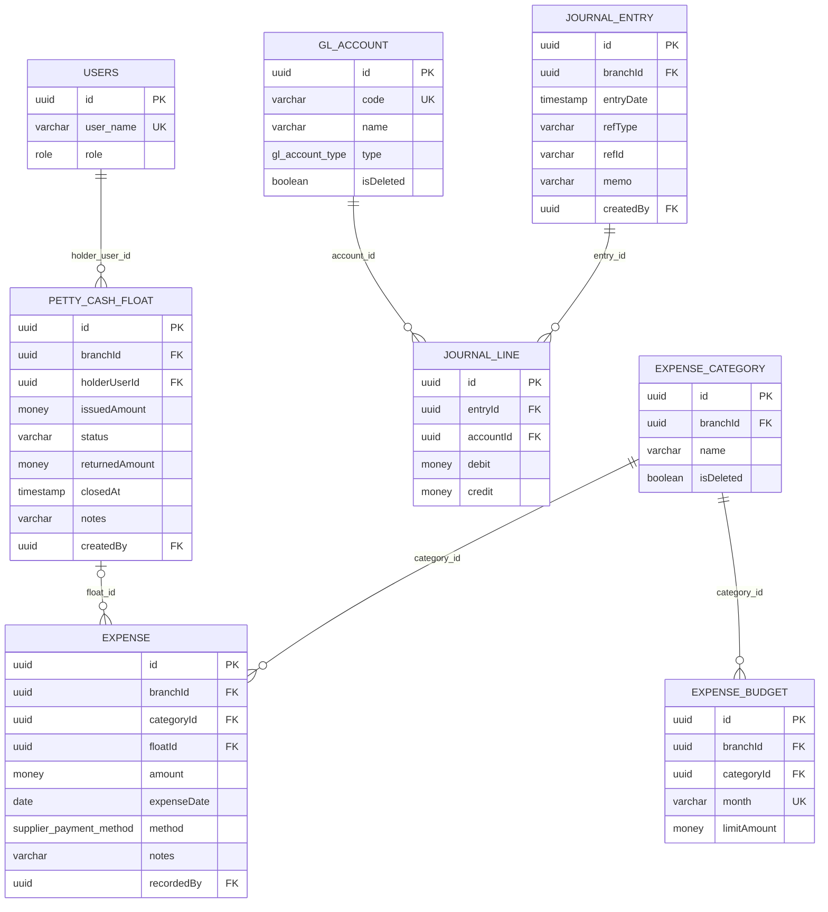
```mermaid
erDiagram
    EXPENSE_CATEGORY {
        uuid id PK
        uuid branchId FK
        varchar name
        boolean isDeleted
    }
    EXPENSE {
        uuid id PK
        uuid branchId FK
        uuid categoryId FK
        uuid floatId FK
        money amount
        date expenseDate
        supplier_payment_method method
        varchar notes
        uuid recordedBy FK
    }
    EXPENSE_BUDGET {
        uuid id PK
        uuid branchId FK
        uuid categoryId FK
        varchar month UK
        money limitAmount
    }
    GL_ACCOUNT {
        uuid id PK
        varchar code UK
        varchar name
        gl_account_type type
        boolean isDeleted
    }
    JOURNAL_ENTRY {
        uuid id PK
        uuid branchId FK
        timestamp entryDate
        varchar refType
        varchar refId
        varchar memo
        uuid createdBy FK
    }
    JOURNAL_LINE {
        uuid id PK
        uuid entryId FK
        uuid accountId FK
        money debit
        money credit
    }
    PETTY_CASH_FLOAT {
        uuid id PK
        uuid branchId FK
        uuid holderUserId FK
        money issuedAmount
        varchar status
        money returnedAmount
        timestamp closedAt
        varchar notes
        uuid createdBy FK
    }
    USERS {
        uuid id PK
        varchar user_name UK
        role role
    }

    EXPENSE_CATEGORY ||--o{ EXPENSE : category_id
    PETTY_CASH_FLOAT |o--o{ EXPENSE : float_id
    EXPENSE_CATEGORY ||--o{ EXPENSE_BUDGET : category_id
    JOURNAL_ENTRY ||--o{ JOURNAL_LINE : entry_id
    GL_ACCOUNT ||--o{ JOURNAL_LINE : account_id
    USERS ||--o{ PETTY_CASH_FLOAT : holder_user_id
```

---

## 6. Staff & notifications

6 tables, plus stubs: counter, users.

Omitted edges: `shift_roster.branch_id → branch`, `shift_roster.created_by → users`, `roster_schedule.branch_id → branch`, `roster_schedule.created_by → users`, `staff_attendance.branch_id → branch`, `notification.branch_id → branch`

**Stubs** (dashed border): `counter`, `users` — cross-group references; full definitions in their owning groups.

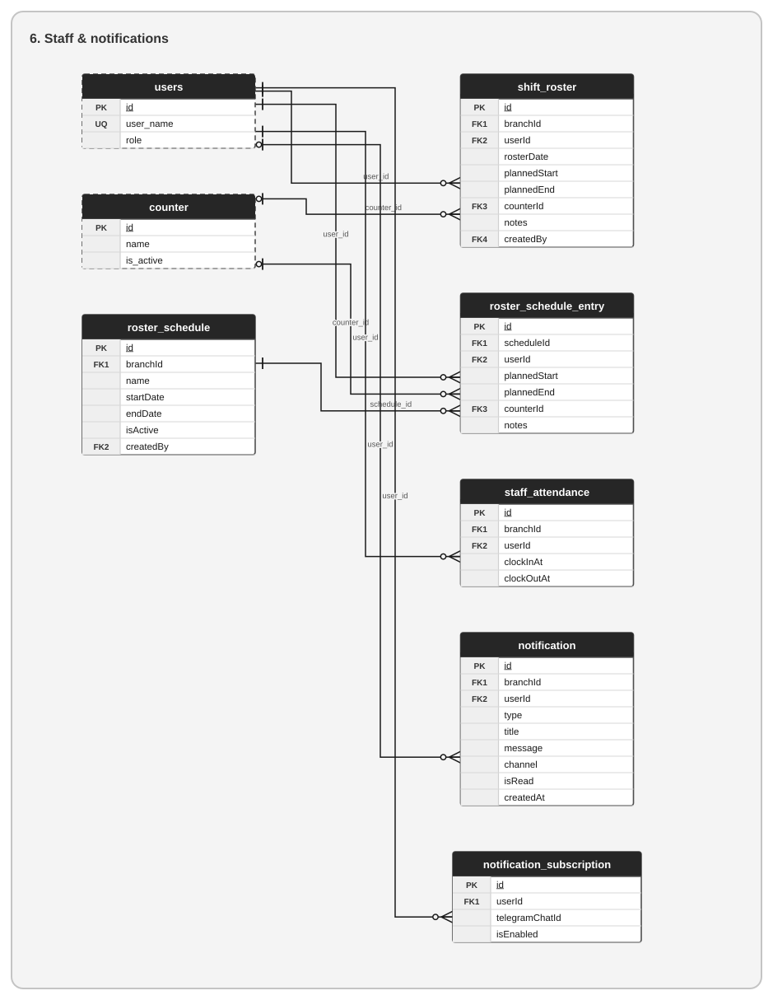

Mermaid source

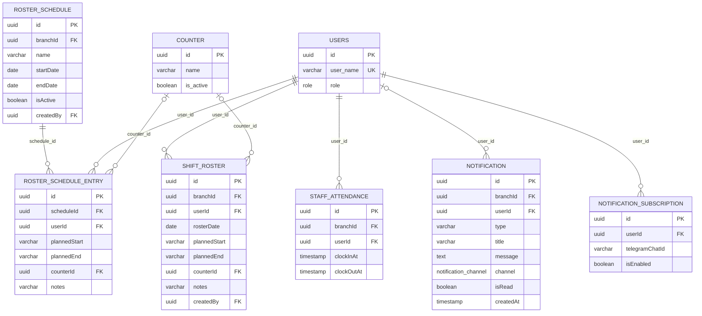
```mermaid
erDiagram
    SHIFT_ROSTER {
        uuid id PK
        uuid branchId FK
        uuid userId FK
        date rosterDate
        varchar plannedStart
        varchar plannedEnd
        uuid counterId FK
        varchar notes
        uuid createdBy FK
    }
    ROSTER_SCHEDULE {
        uuid id PK
        uuid branchId FK
        varchar name
        date startDate
        date endDate
        boolean isActive
        uuid createdBy FK
    }
    ROSTER_SCHEDULE_ENTRY {
        uuid id PK
        uuid scheduleId FK
        uuid userId FK
        varchar plannedStart
        varchar plannedEnd
        uuid counterId FK
        varchar notes
    }
    STAFF_ATTENDANCE {
        uuid id PK
        uuid branchId FK
        uuid userId FK
        timestamp clockInAt
        timestamp clockOutAt
    }
    NOTIFICATION {
        uuid id PK
        uuid branchId FK
        uuid userId FK
        varchar type
        varchar title
        text message
        notification_channel channel
        boolean isRead
        timestamp createdAt
    }
    NOTIFICATION_SUBSCRIPTION {
        uuid id PK
        uuid userId FK
        varchar telegramChatId
        boolean isEnabled
    }
    COUNTER {
        uuid id PK
        varchar name
        boolean is_active
    }
    USERS {
        uuid id PK
        varchar user_name UK
        role role
    }

    USERS ||--o{ SHIFT_ROSTER : user_id
    COUNTER |o--o{ SHIFT_ROSTER : counter_id
    ROSTER_SCHEDULE ||--o{ ROSTER_SCHEDULE_ENTRY : schedule_id
    USERS ||--o{ ROSTER_SCHEDULE_ENTRY : user_id
    COUNTER |o--o{ ROSTER_SCHEDULE_ENTRY : counter_id
    USERS ||--o{ STAFF_ATTENDANCE : user_id
    USERS |o--o{ NOTIFICATION : user_id
    USERS ||--o{ NOTIFICATION_SUBSCRIPTION : user_id
```

---

## 7. AI

4 tables, plus stubs: users.

Omitted edges: `ai_api_key.created_by → users`, `ai_api_key.updated_by → users`, `ai_model.created_by → users`, `ai_model.updated_by → users`, `ai_chat_conversation.branch_id → branch`

**Stubs** (dashed border): `users` — cross-group references; full definitions in their owning groups.

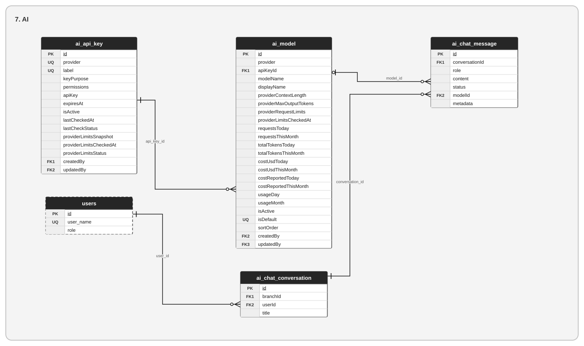

Mermaid source

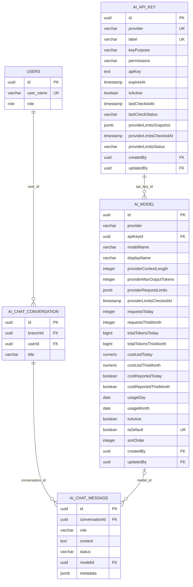
```mermaid
erDiagram
    AI_API_KEY {
        uuid id PK
        varchar provider UK
        varchar label UK
        varchar keyPurpose
        varchar permissions
        text apiKey
        timestamp expiresAt
        boolean isActive
        timestamp lastCheckedAt
        varchar lastCheckStatus
        jsonb providerLimitsSnapshot
        timestamp providerLimitsCheckedAt
        varchar providerLimitsStatus
        uuid createdBy FK
        uuid updatedBy FK
    }
    AI_MODEL {
        uuid id PK
        varchar provider
        uuid apiKeyId FK
        varchar modelName
        varchar displayName
        integer providerContextLength
        integer providerMaxOutputTokens
        jsonb providerRequestLimits
        timestamp providerLimitsCheckedAt
        integer requestsToday
        integer requestsThisMonth
        bigint totalTokensToday
        bigint totalTokensThisMonth
        numeric costUsdToday
        numeric costUsdThisMonth
        boolean costReportedToday
        boolean costReportedThisMonth
        date usageDay
        date usageMonth
        boolean isActive
        boolean isDefault UK
        integer sortOrder
        uuid createdBy FK
        uuid updatedBy FK
    }
    AI_CHAT_CONVERSATION {
        uuid id PK
        uuid branchId FK
        uuid userId FK
        varchar title
    }
    AI_CHAT_MESSAGE {
        uuid id PK
        uuid conversationId FK
        varchar role
        text content
        varchar status
        uuid modelId FK
        jsonb metadata
    }
    USERS {
        uuid id PK
        varchar user_name UK
        role role
    }

    AI_API_KEY ||--o{ AI_MODEL : api_key_id
    USERS ||--o{ AI_CHAT_CONVERSATION : user_id
    AI_CHAT_CONVERSATION ||--o{ AI_CHAT_MESSAGE : conversation_id
    AI_MODEL |o--o{ AI_CHAT_MESSAGE : model_id
```

---

## Group overview (packages)

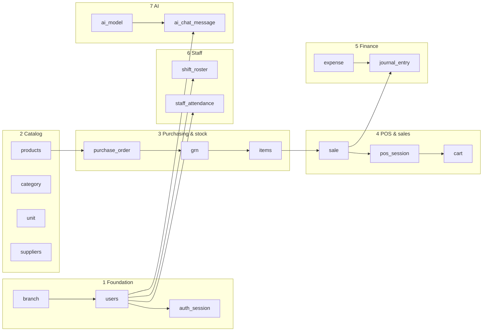
```mermaid
flowchart LR
    subgraph G1[1 Foundation]
        Branch[branch]
        Users[users]
        Session[auth_session]
    end
    subgraph G2[2 Catalog]
        Products[products]
        Category[category]
        Unit[unit]
        Supplier[suppliers]
    end
    subgraph G3[3 Purchasing & stock]
        PO[purchase_order]
        GRN[grn]
        Items[items]
    end
    subgraph G4[4 POS & sales]
        Sale[sale]
        SessionPOS[pos_session]
        Cart[cart]
    end
    subgraph G5[5 Finance]
        Journal[journal_entry]
        Expense[expense]
    end
    subgraph G6[6 Staff]
        Roster[shift_roster]
        Attend[staff_attendance]
    end
    subgraph G7[7 AI]
        Model[ai_model]
        Chat[ai_chat_message]
    end
    Branch --> Users
    Users --> Session
    Products --> PO
    PO --> GRN
    GRN --> Items
    Items --> Sale
    Sale --> SessionPOS
    SessionPOS --> Cart
    Sale --> Journal
    Expense --> Journal
    Users --> Roster
    Users --> Attend
    Users --> Chat
    Model --> Chat
```

---

## Enum types in the schema

| Enum                      | Values                                    |
| ------------------------- | ----------------------------------------- |
| `role`                    | admin, inventory, cashier                 |
| `po_status`               | pending, partially_received, received     |
| `po_approval_status`      | pending, approved, rejected               |
| `payment_status`          | unpaid, partial, paid                     |
| `sale_status`             | pending, completed, voided                |
| `payment_method`          | cash, card, mobile, credit                |
| `pos_session_status`      | active, closed                            |
| `transfer_status`         | pending, approved, in_transit, received   |
| `supplier_return_status`  | draft, confirmed                          |
| `sale_return_status`      | pending, approved                         |
| `return_disposition`      | restock, damage                           |
| `promotion_type`          | percentage, fixed, bundle, seasonal       |
| `promotion_status`        | draft, active, expired, deactivated       |
| `supplier_payment_method` | cash, bank_transfer, mobile_payment       |
| `notification_channel`    | in_app, telegram                          |
| `ground_balance_status`   | pending, completed, cancelled             |
| `adjustment_reason`       | damage, loss, found, correction           |
| `gl_account_type`         | asset, liability, equity, income, expense |

**Conventions:** UUID PKs (exceptions: `app_setting.key`, `ground_balance.batch_no`; junctions `user_branch` / `supplier_product` use composite logical PKs of their FK columns); `numeric` money; `timestamp` UTC; soft-delete `is_deleted` on master data; every column listed exactly as declared in `schema.ts`.
